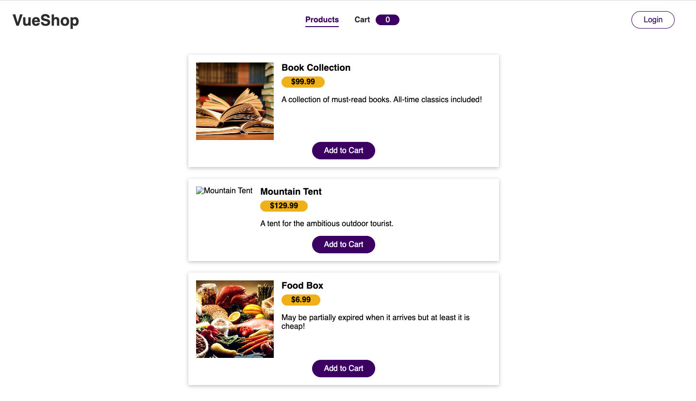

# VueShop

Migrate the existing state to Vuex. 

## Getting Started

``npm i``

``npm run serve`` 

``npm install --save vuex``

## Learning/ progress

Initial Code 

* image to tent is broken
* Login button does not work
* current state local local inject

## Resources