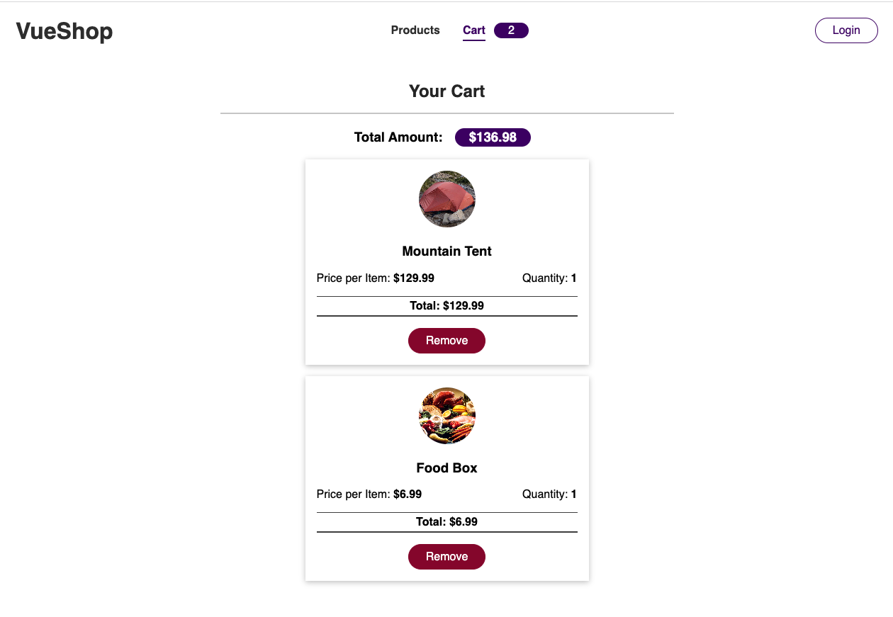

# VueShop

Migrate the existing state to Vuex. 

Notes:

There is a lot to learn and practice. 

* actions
* mutations
* getters
* namespaced
* (state, payload)

## Getting Started

``npm i``

``npm run serve`` 

``npm install --save vuex``

## Learning/ progress

Initial Code 

* image to tent is broken
* 'Login" button does not work
* current state local local inject

Completed Vue Shop with Vuex

Products

Cart

Admin 

**Plenty more to do:**

* Create an actual Admin page with Authentication and functionality 
* Add media breakpoints for different screen sizes 

## Resources

Challenge/ Practice is from Udemy course by Maximilian Schwarzmüller.

